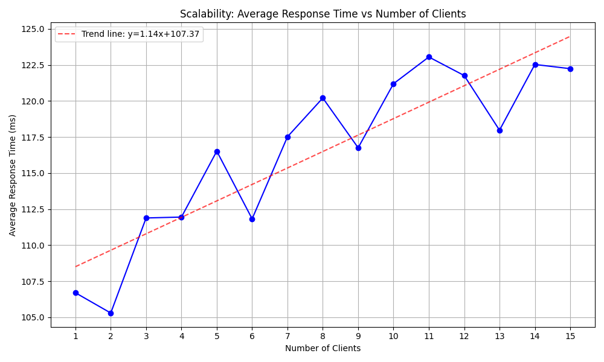

# Distributed Systems: Programming Assignment 1 documentation

Team name: ezpz

  name: Federico Cucinotta

  student number: s4548647

  I did everything for this assignment as I was alone.

Design and implementation decisions
-----------------------------------

One of the biggest questions I had for this assignment was about how to deal with the sequence numbers when multiple clients are calling `getSequenceNumber()` concurrently. After some research, I decided to use AtomicInteger. Atomic integer takes care of the logic to make `getSequenceNumber()` thread-safe and prevents race conditions. If a client calls `sequenceNumber.getAndIncrement()` concurrently (at the same time as another client), the AtomicInteger will ensure that the second client gets the next available unique sequence number, instead of providing the same.

The other challenge was the barrier. The constructor in `ServerImplementation.java` initializes the CyclicBarrier with the number of clients. `CyclicBarrier()` allows a fixed number of threads (in this case clients) to wait at a barrier point until all threads have arrived. Once all threads have arrived, the barrier is "broken," and all threads are released to continue execution (Piwowarek, 2024). This is done to make sure that all clients start the task at the same time. In turn, this makes it possible to measure the time taken for a specific operation.

To make sure that the clients succesfully connect to the server, the client has a retry logic, which attempts to connect to the server a maximum of 5 times, with a 2 second delay in-between each try. When testing, it has happened a few times that the client failed 1 or more times before being able to connect to the server, so this logic is needed.

Finally, when the clients are done, they call the `setDone()` method, which lets the server know this. The server then converts the aggregated time of all client calls into microseconds, gets the total number of calls, which is dependent on the number of nodes, and divides `aggregatedTime / totalCalls;`. This is also the final output of the program. 

Results
-------
The run-all.sh script only tests certain number of nodes. However, for a more complete and clearer graph, I decided to run it for all possible number of nodes 1-16. For each number of nodes, I ran my system 5 times, such that I could calculate an average and plot that instead. Below are the results.

The graph shows that the average response time generally increases as the number of clients increases. This is likely due to the system experiencing a higher load as more clients are making calls to the server. However, even though there is an increasing trend, there are clear fluctuations. Although it is hard to say what these are caused by, reasons could be Network conditions (e.g., temporary congestion), propagation delay, and more (GeeksforGeeks, 2024).

Acknowledgements for any collaboration or outside help received
---------------------------------------------------------------
 - https://www.baeldung.com/java-cyclic-barrier
 - https://www.baeldung.com/java-wait-notify
 - https://www.baeldung.com/java-rmi
 - https://www.geeksforgeeks.org/latency-in-distributed-system/

